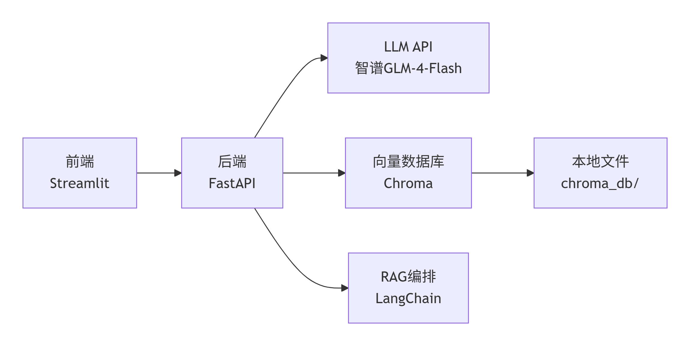

## 项目简介
这是一个基于 `FastAPI + ChromaDB + LangChain + Streamlit` 的电商 RAG 问答个人入门学习项目。

## 项目结构
```text
app/
├── __init__.py
├── main.py
├── agent.py
├── vector_store.py
├── models.py
└── prompts.py
data/
├── products.json
└── init_db.py
frontend/
└── streamlit_app.py
requirements.txt
pyproject.toml
.env
```

## 环境准备
1. Python 版本建议 `3.10+`
2. 在项目根目录创建 `.env`

`.env` 示例：
```env
ZHIPUAI_API_KEY=你的智谱API_KEY
```

## 安装依赖
推荐使用 `uv`：

```powershell
uv sync
```

如果你使用传统 `pip`：

```powershell
python -m pip install -r requirements.txt
```

## 初始化向量库
首次运行前，先把 `data/products.json` 中的商品写入 Chroma：

```powershell
uv run python data/init_db.py
```

如果你用的是 `pip` 环境：

```powershell
python data/init_db.py
```

## 启动后端
启动 FastAPI 服务：

```powershell
uv run uvicorn app.main:app --reload
```

启动后可访问：

- 健康检查：[http://127.0.0.1:8000/health](http://127.0.0.1:8000/health)
- 接口文档：[http://127.0.0.1:8000/docs](http://127.0.0.1:8000/docs)

## 启动前端
新开一个终端，运行：

```powershell
uv run streamlit run frontend/streamlit_app.py
```

启动后在浏览器打开 Streamlit 页面即可提问。

## 使用流程
1. 配置 `.env`
2. 执行 `uv sync`
3. 执行 `uv run python data/init_db.py`
4. 执行 `uv run uvicorn app.main:app --reload`
5. 执行 `uv run streamlit run frontend/streamlit_app.py`

## 数据集说明
当前 `data/products.json` 已提供 50 条电商商品数据，可直接用于初始化向量库。


